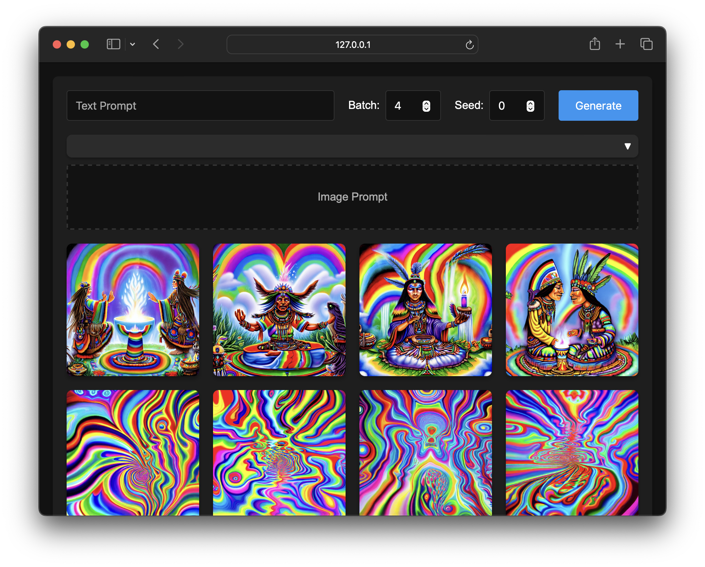
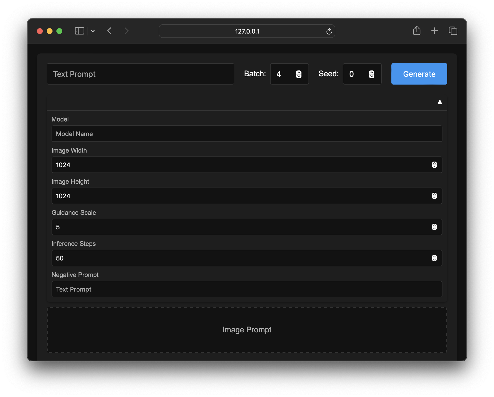

# imagine

> "*Imagination is the beginning of creation. You imagine what you desire, you will what you imagine, and at last you create what you will.*"
>     - George Bernard Shaw

   
  
   

### Overview

A simple and extensible model-agnostic web interface for text-to-image generation.

### Features

- Text-to-image and image-to-image generation capabilities.
- Batch image processing support.
- Persistent image and prompt database storage with complete metadata coverage.
- RESTful API backend for plug-and-play client-side model configuration.
- Extendible inference settings panel for fine-grained control of generations.
- Seamless ablation of prompting workflows across models.

### Advanced Settings

There are three main arguments used when submitting generations:

- **Prompt**: Text description that specifies the contents and style of the image.
- **Seed**: Random seed used to ensure reproducibility across identical runs.
- **Batch**: Number of different images to generate in a single run.

An additional collapsible interface can be expanded for modifying other  inference arguments:

- **Guidance Scale**: Controls how closely the generated image aligns with the input prompt(s).
- **Inference Steps**: Determines the generation quality and detail. More steps produce greater detail at the cost of inference time.
- **Image Width**: Sets the output image width in pixels.
- **Image Height**: Sets the output image height in pixels.
- **Negative Prompt**: Text description that specifies what to avoid generating in the image.

   
  
   

